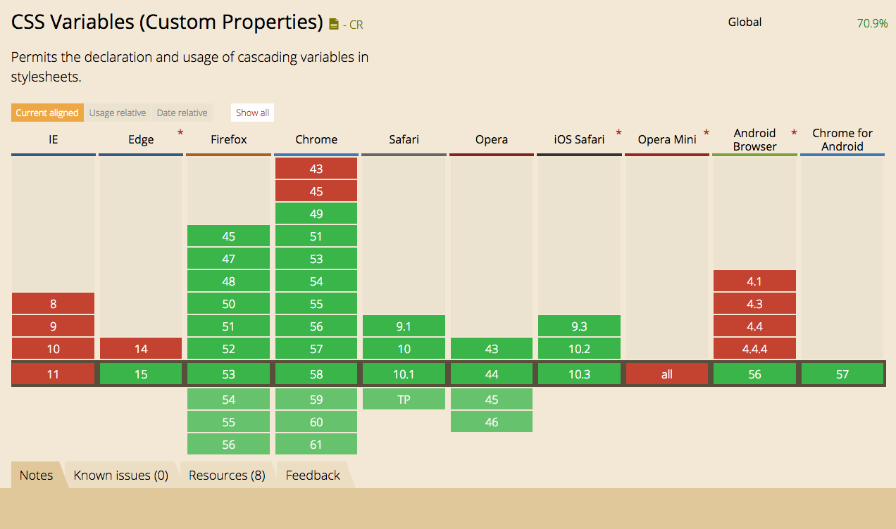

# CSS Variables


## It is a CSS4 specification
Can I use it? http://caniuse.com/#feat=css-variables



## How it works
CSS variables is a variables for styles that resolves by browser in **runtime**. Don't be confused by SCSS variables there is a difference.
So, CSS variables could be defined in one file, and used in another.

### Thats how we can use it

Here we define variables' values. We build this files after any changes on travix-themes and then put them on CDN.
##### theme.css
```css
:root {
  --primary-color: #fafa60
}
```


Here we consume variables:
##### bundle.css
```css
.button {
  color: var(--primary-color); // --> resolves to #fafa60 by browser internally
}
```

*That's it*

### SCSS and CSS variables
#### You can't reuse CSS variables in SCSS code
They have different purpose and runtime environment. But you can still use theme-builder and build SCSS theme for your needs.
Main idea to get rid of all SCSS variables you need for theming.

## Pros & Cons

| Pros | Cons     |
| :------------- | :------------- |
| native browser support       | need a polyfill\fallback       |
| part of standard       | weird syntax       |
| no extra dependencies       | have all the variables in runtime       |

## Fallback is included
I wrote and test small script with bring some power of CSS Vars to old browsers.
```js
"use strict";[].forEach.call(document.querySelectorAll("[data-cssvars]"),function(e){var t=e.href,n=new
XMLHttpRequest;n.open("GET",t,!0),n.onreadystatechange=function(){if(4===n.readyState&&(200===n.status
||0===n.status)){var e=document.createElement("style");document.head.appendChild(e),
e.innerText=n.responseText.split("\n").join("").replace(/var\(--([\w-]+)\)/g,function(e,t){
return(window.TravixTheme||{})[t]})}},n.send(null)});
```
